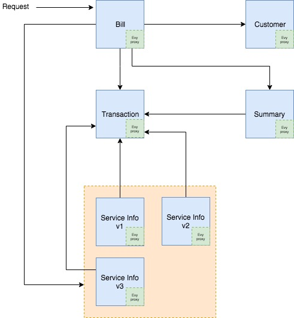

Billing application 
====================
This is a sample billing application to be deployed and run on Kubernetes cluster with Istio support. 

Following is the Service Mesh for billing appliation.

Source code is in the respective folders. 

For more information on Kubernetes visit https://kubernetes.io/.

For more information on Istio visit https://istio.io.

## Setup
You can deploy on your local Kubernetes cluster or can use minikube. 

### Start minikube
`$ minikube stop` 

`$ minikube delete` 

Start Minikube with 8192 MB of memory and 4 CPUs (recommended):

`$ minikube start --memory=8192 --cpus=4` 

### Download Istio

`$ curl -L https://git.io/getLatestIstio | sh -`

### Set path

`$ cd istio-1.0.2`
`$ export PATH=$PWD/bin:$PATH`

Recommended option is the set path in your .bash_profile file:

`$ vim ~/.bash_profile`

### Install Istio on Kubernetes cluster 

CD into the Istio insall directory on your machine.

Deploy Istio Custom Resource Definition:

`$ kubectl apply -f install/kubernetes/helm/istio/templates/crds.yaml`

Install Istio wihtout mutual TLS authentication:

`$ kubectl apply -f install/kubernetes/istio-demo.yaml`

-- OR -- 

Install Istio with default mutual TLS authentication:

`$ kubectl apply -f install/kubernetes/istio-demo-auth.yaml`

### Verify Istio Installation 

All Pods should either be completed or running. Alls services deployed.

`$ kubectl get pods -n istio-system`
`$ kubectl get svc -n istio-system`

### Deploy Billing appliation with Istio support

`$ kubectl apply -f <(istioctl kube-inject -f kubernetes/billing-deploy.yaml)`

Here we are calling `istioctl kube-inject` to manually inject Envoy containers in our application pod before deploying them. 

You can inject Envoy sidecar container automatically by setting `istio-injection=enabled` on the namespace you want automatic injection. Below command will enable automatic injection in `default` namespae:

`$ kubectl label namespace default istio-injection=enabled`

## Expose Bill Service 

### Call Bill Service from inside cluster 

SSH into minikube:

`$ minikube ssh`

Run Curl with Bill service IP address and port:

`$ curl http://10.104.42.80:9004/123`

### Call Bill Service outside of cluster 

#### Option 1 - Expose using NodePort or Loadbalancer service

`$ billpod=$(kubectl get po --selector=app=bill -o jsonpath={.items..metadata.name})`

`$ kubectl expose pod $billpod --name=bill-external  --type=NodePort --port=9004 --target-port=9004`

Note cluster ip address:

`$ kubectl cluster-info`

Call the bill service with the cluster IP and NodePort:

 `$ curl http://192.168.99.100:30470/123`

 You can also access the same URL in your browser or Postman.

#### Option 2 - Expose using Istio default Gateway

Deploy the Gateway which will use istio default ingress:

`$ kubectl apply -f istio/billing-gateway.yaml`

Configure bill virtual service to be called through Gateway:

`$ kubectl apply -f istio/virtual-service-bill.yaml` 

Call the bill service with the Gateway URL:

`http://192.168.99.100:31380/123`

There are two parts of URL. IP address and port. To get URL and port, run following command:

`$ kubectl get svc -n istio-system`

Note down the external IP and port mapped with port 80 for service name `istio-ingressgateway` against type LoadBalancer. Note that if you deploy your cluster on infrastructure that is supported by external load balancer (e.g. AWS), kubernetes automatically configures load balancer and provide the external IP. If you don't have such setup (e.g. minikube), you will see exteral IP in pending state. In this case you can use minikube IP address. 

To get minikube IP address run following command:

`$ kubectl cluster-info`
-- OR -- 
`$ minikube ip`

Note that we are using host as `*` in the hosts field in Gateway and Virtual Service. This is to allow to call through browser for all host. You can use `billservice.com` as hosts name in the Gateway and Virtual Service but in this case you will have to pass the Host header in the HTTP request with the value set to `billservice.com`.

For example:

`curl -H "Host: bill-service.com" http://192.168.99.100:31380/123`

In Chrome, you can enable the extension (e.g. ModHeader) to pass Host header. Postman doesn't allow you to pass Host header. If you are using Postman chrome extension, you can add "Postman Interceptor" chrome extension to pass Host header.  

For more information on Host header see below link:

https://tools.ietf.org/html/rfc7230#section-5.4

https://stackoverflow.com/questions/43156023/what-is-http-host-header

## Traffic Management 

### Destination Rules 

When you refresh the browser you will notice that serviceinfo.serviceVersion will be switching between v1/v2/v3. This is because we deployed three versions of billing-service-info and exposed through one billing-service-info-service which load balance traffic among version v1/v2/v3. 

Before you can use Istio to control the version routing, you need to define the available versions, called subsets in destination rules.

Deploy destination rule for billing-service-info-service to control version:

`$ kubectl apply -f istio/destination-rule-all.yaml`

### Request Routing 

You can route request to a particuar version based on HTTP reqeust. 

Deploy following virtual service which will route traffic to v2 of billing-servie-info if custom header `x-api-key` is set as `123456` in HTTP request. If custom header `x-api-key` is not present or value not set as `123456`, it will route traffic to v1 of billing-servie-info. This routing is handy for canary testing or expose specific version of service to certain client/caller based on client api-key. 

`$ kubectl apply -f istio/virtual-service-billing-service-info-v2.yaml`

### Traffic Split or Weight

You can split traffic or apply weight e.g. 50/50 to v1/v3. This is useful for canary variation testing or A/B testing. 

Deploy following virtual service to split traffic to 50/50 to v1/v3:

`$ kubectl apply -f istio/virtual-service-billing-service-info-50-v3.yaml`

Calling service will route traffic 50/50 to v1/v3. 

### Routing all traffic to specific/new version

After you finished with canary or A/B testing and decide to switch to a new version, you can route all traffic to new version. 

Deploy following virtual service to route all traffic to v3:

`$ kubectl apply -f istio/virtual-service-billing-service-info-v3.yaml`

Calling servie will route all traffic to v3.

### Fault Injection

You can inject fault to test different scenarios during testing. 

#### Injecting Delay Fault

Following virtual service will inject fault of 7 seconds delay in 80% of the requests to the v1 version of the customer-service:

`$ kubectl apply -f istio/virtual-service-customer-service-delay.yaml`

#### Injecting Abort Fault

Following virtual servie will inject fault to returns an HTTP 400 error code for 80% of the requests to the customer-service service v1. This is useful to test secnario of intermittent failure of customer-service. 

`$ kubectl apply -f istio/virtual-service-customer-service-abort.yaml`

### Timeout

You can configue timeout for a particular service. 

Following virtual will set timeout of customer-service to 10 seconds:

`$ kubectl apply -f istio/virtual-service-customer-service-timeout.yaml`

### Retries

You can configue retry attampts for a particular service. 

Following virtual will set 3 retry attempts with timeout of 2s for customer-service:

`$ kubectl apply -f istio/virtual-service-customer-service-retries.yaml`

Note that you can fine tune timeout and retry for each request by passing the `x-envoy-upstream-rq-timeout-ms` and `x-envoy-max-retries` headers with the requried timeout and retry values. 

### Circuit Breaker

Following destination rule will set circuit breaker rules on customer-service:

`$ kubectl apply -f istio/destination-rule-customer-service-circuit-breaker.yaml` 

To test circut breaker deploy fortio load testing client.

CD into Istio install diretory on your machine and run following command:

`$ kubectl apply -f <(istioctl kube-inject -f samples/httpbin/sample-client/fortio-deploy.yaml)`

Log in to the fortio pod and make 3 concurrent connections (-c 3) and send 20 requests (-n 20): to customer-service:

`$ FORTIO_POD=$(kubectl get pod | grep fortio | awk '{ print $1 }')`

`$ kubectl exec -it $FORTIO_POD  -c fortio /usr/local/bin/fortio -- load -c 3 -qps 0 -n 20 -loglevel Warning  http://customer-service:9001/123`

See following link for different Traffic Management rules you can apply 
https://istio.io/docs/concepts/traffic-management/

## Policy

### Rate Limiting

You can apply Rate Limiting by setting quotas. 

Below rule will set quota on billing-service as follow;
* Default of 20 requests in 20 seconds 
* If request comes from IP address 10.10.1.1 (`x-forwarded-for` header) and destination is bill-service, it will apply quota of 5 requests in 5 seconds 
* If destination of request is bill-service, will apply quota of 2 requsts in 5 seconds

Deploy above rate limit:

`$ kubectl apply  -f istio/mixer-rule-bill-service-ratelimit.yaml` 

Note that I am using memquota here but for your prodution workload you should conside Redis. 

### Denials

Deploy following rule to deny traffic from bill-service to v3 of billing-service-info-service:

`$ kubectl apply -f istio/billing-mixer-rule-deny-label.yaml` 

### Whitelisting

Similar to denials, you can use whitelisting to deny traffic from bill-service to v3 of billing-service-info-service.

Deploy following rule:

`$ kubectl apply -f istio/billing-whitelist.yaml`

## Monitoring

### Jaeger

Jaeger provides distriuted tracing information for each HTTP request made to other services. It shows call trace along with the time spent for each request. 

Jaeger is deployed as an application (pod) during Istio installation. You can see Jaeger pod running with prefix istio-tracing under istio-system namespace. 

To access Jaeger on your local Kubernetes cluster you can either expose the pod through service or forward port on which Jaeger pod is listening on. 

We will use the port forward to avoid creating service but for your production Istio deployment you should expose it via service and restrict it to trusted individuals only. 

Run following command to forward port to host operating system:

`$ kubectl port-forward -n istio-system $(kubectl get pod -n istio-system -l app=jaeger -o jsonpath='{.items[0].metadata.name}') 16686:16686 &`

To access UI, enter following URL in the browser with the port 16686:

`http://localhost:16686`

Note that in order for distributed tracing to work you need to forward following headers from the incoming request to any outgoing requests:

* x-request-id
* x-b3-traceid
* x-b3-spanid
* x-b3-parentspanid
* x-b3-sampled
* x-b3-flags
* x-ot-span-context

In our sample Billing application we are forwarding all hearders from incoming request to outgoing requests. 

### Prometheus

Prometheus is powerful for monitoring your service mesh. For more information on Prometheus visit following link https://prometheus.io/.

To access Prometheus UI you can either access the service created with Istio deployment or do port forwarding. 

Run following command to port forward to host operarting system: 

`$ kubectl -n istio-system port-forward $(kubectl -n istio-system get pod -l app=prometheus -o jsonpath='{.items[0].metadata.name}') 9090:9090 &`

To access UI, enter following URL in the browser with the port 9090:

`http://localhost:9090/graph`

In your production Istio deployment you should expose it via service and restrict it to trusted individuals only. 

In the Prometheus UI, enter `istio_requests_total` in the input box and click Execute button. You should see result. 

Enter query `istio_requests_total{destination_service="bill.default.svc.cluster.local"}` and see result of bill-service. 

To see total count of all requests to v3 of the billing-service-info, enter this query `istio_requests_total{destination_service="billing-service-info.default.svc.cluster.local", destination_version="v3"}`

To see rate of requests over the past 10 minutes to all instances of the bill-service, enter this query `rate(istio_requests_total{destination_service=~"bill.*", response_code="200"}[10m])`

For lean more about Prometheus query see this link:

 https://prometheus.io/docs/prometheus/latest/querying/basics/.

### Grafana

Grafana dashboard returns the total number of requests currently being processed, along with the number of errors and the response time of each call.

To access Grafana UI you can either access the service created with Istio deployment or do port forwarding. 

Run following command to port forward to host operarting system:

`$ kubectl -n istio-system port-forward $(kubectl -n istio-system get pod -l app=grafana -o jsonpath='{.items[0].metadata.name}') 3000:3000 &`

For Istio mesh dashboard enter following URL:

`http://localhost:3000/dashboard/db/istio-mesh-dashboard`

For Istio service dashboard enter following URL. This will show your services:

`http://localhost:3000/dashboard/db/istio-service-dashboard`

For Istio workload dashboard enter following URL:

`http://localhost:3000/dashboard/db/istio-workload-dashboard`

You can switch between various dashboard by clicking Dashboard menu or access this URL which will show you all dashboards:

`http://localhost:3000/dashboards`

In your production Istio deployment you should expose it via service and restrict it to trusted individuals only. 

For learn more about Grafana, see this link http://docs.grafana.org/.

### Service Graph

The Service Graph shows dependency of services. This is handly specially when services grow.

To access Service Graph UI you can either access the service created with Istio deployment or do port forwarding. 

Run following command to port forward to host operarting system:

`kubectl -n istio-system port-forward $(kubectl -n istio-system get pod -l app=servicegraph -o jsonpath='{.items[0].metadata.name}') 8088:8088 &`

To access UI, enter following URL in browser:

`http://localhost:8088/force/forcegraph.html`

Click on each service to see service details. 

You can try Query Parameters with the link above e.g. `http://localhost:8088/force/forcegraph.html?time_horizon=10s&filter_empty=true` 

Two parameters are provided:

* `filter_empty=true` will only show services that are currently receiving traffic within the `time_horizon`.
* `time_horizon=10s` is used in combination with above. 

Default value of `filter_empty` is `false` and `time_horizon` is `5m`.

Service Graph also provides following additional end points for different graphs:
* `/force/forcegraph.html` As used above.
* `/dotviz` is a static Graphviz visualization.
* `/dotgraph` provides a DOT serialization.
* `/d3graph` provides a JSON serialization for D3 visualization.
* `/graph` provides a generic JSON serialization.

All above endpoints accepts query parameters as mentioned above.

### Weave Scope

Weave Scope provides visual graph of how microservices are connected. It shows what processes are running within each pod and which pod is communicating with other pod. 

Deploy Weave Scope: 

`$ kubectl create -f 'https://cloud.weave.works/launch/k8s/weavescope.yaml'`

Check pods are running:

`$ kubectl get pods -n weave`

Expose Weave Scope service:

`$ pod=$(kubectl get pod -n weave --selector=name=weave-scope-app -o jsonpath={.items..metadata.name})`

`$ kubectl expose pod $pod -n weave --type=NodePort --port=4040 --target-port=4040`

Check the service and note the NodePort port:

`$ kubectl get svc -n weave`

Use the cluster IP and NodePort to access in the browser:

`http://192.168.99.100:31590/`

Note that Weave Scope is a powerful tool and should be secured and restricted to trusted individuals only.

## See Istio Deployed Resources 

To see deployed Gateways:

`$ kubectl get gateways`

-- OR -- 

`$ istioctl get gateways`

To see deployed Destination Rules: 

`$ kubectl get destinationrules` 

-- OR -- 

`$ istioctl  get destinationrules`

To see deployed Virtual Services:

`$ kubectl get virtualservices`

`$ istioctl get virtualservices`

## Cleanup

Delete virtual services:

`$ kubectl delete -f istio/virtual-service-bill.yaml`

`$ kubectl delete -f istio/virtual-service-billing-service-info-v3.yaml`

`$ kubectl delete -f istio/virtual-service-customer-service-delay.yaml`

`$ kubectl delete -f istio/virtual-service-customer-service-abort.yaml`

`$ kubectl delete -f istio/virtual-service-customer-service-timeout.yaml`

`$ kubectl delete -f istio/virtual-service-customer-service-retries.yaml`

Delete Destination Rule:

`$ kubectl delete -f istio/destination-rule-all.yaml`

`$ kubectl delete -f istio/destination-rule-customer-service-circuit-breaker.yaml` 

Delete Gateway:

`$ kubectl delete -f istio/billing-gateway.yaml`

Delete Policy:

`$ kubectl delete -f istio/billing-mixer-rule-deny-label.yaml` 

`$ kubectl delete -f istio/billing-whitelist.yaml`

`$ kubectl delete  -f istio/mixer-rule-bill-service-ratelimit.yaml` 

Delete Billing Deployment:

`$ kubectl delete -f kubernetes/billing-deploy.yaml`

Delete Weave Scope:

`$kubectl delete -f 'https://cloud.weave.works/launch/k8s/weavescope.yaml'`

Delete Istio Installation:

CD into the Istio insall directory on your machine.

`$ kubectl delete -f install/kubernetes/helm/istio/templates/crds.yaml`

`$ kubectl delete -f install/kubernetes/istio-demo.yaml`

      --  OR (if you installed mTLS)-- 

`$ kubectl delete -f install/kubernetes/istio-demo-auth.yaml`

Delete fortio load testing client:

`$ kubectl delete -f samples/httpbin/sample-client/fortio-deploy.yaml`
